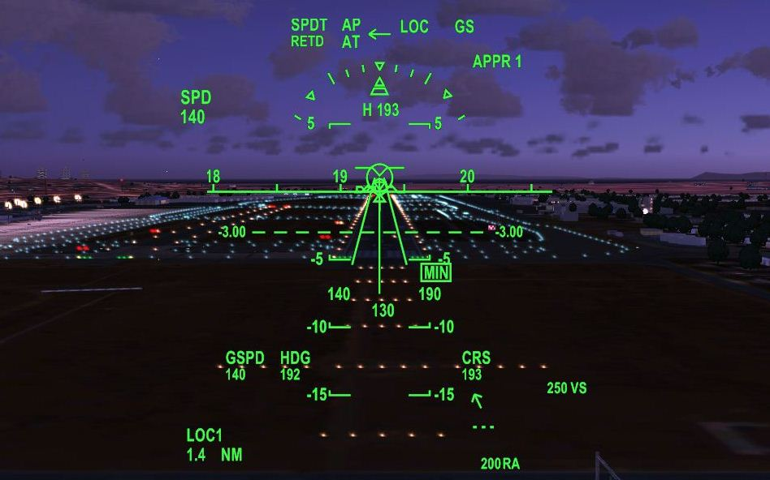
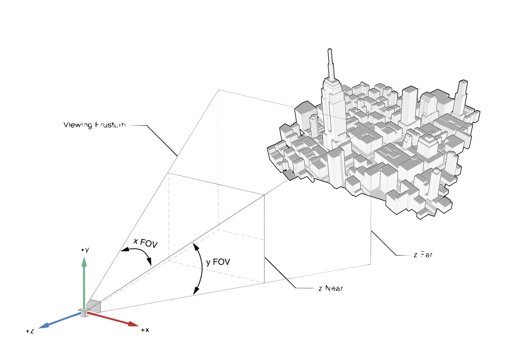
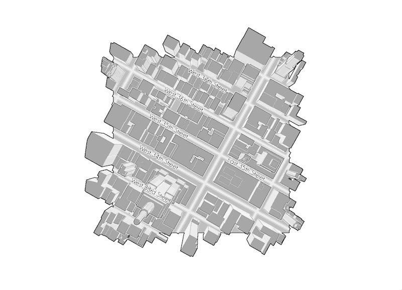
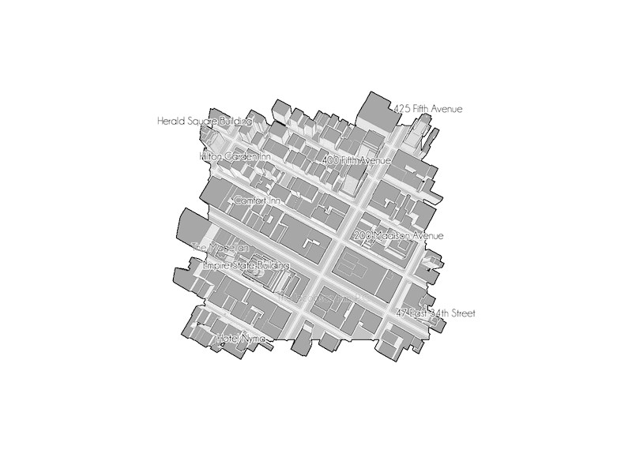

## Tangram-Tile

These addon is a wrapper from a [Mapzen](mapzen.com) [Tangram](https://github.com/tangrams) experiment on 3D Labels 

## Install

Install addons dependences: 

```
	cd openFrameworks/addons
	git clone --depth 1 http://github.com/jefftimesten/ofxJSON.git
```

## Add to project

Install ```ofxTangramTile``` to your project using the ProjectGenerator, dragging folder or Adam’s [OFPlugin](https://github.com/admsyn/OFPlugin). 

On the project Properties (the blue icons with the name of your project) go to `Building Settings` > `Linking` > `Other Linker Flags` and add `-lcurl`

## Dependences

- [ofxJSON](https://github.com/jefftimesten/ofxJSON)

## Sources

- [glmTile](https://github.com/tangrams/glmTile)

	* [glmTools](https://github.com/tangrams/glmTools)
		-	[openGL](http://www.opengl.org/)
		- [glm](http://glm.g-truc.net/0.9.5/index.html)

	* [cURL](http://curl.haxx.se/libcurl/)
	* [JsonCpp](https://github.com/open-source-parsers/jsoncpp)
	* [Fontstash](https://github.com/memononen/fontstash)


## The Problem
Labels in maps are a huge headache, and have been for a long time. There are lots of solutions for 2D mapping, but not so many when you work in 3D, and especially not when your map shifts between 2D and 3D. 

## The Experiements

The main trick is a 2D projection of the geometry to place the text, within the canvas. Like a heads-up display layer between the 3D geometry and the camera.

Like this: 


In the canvas: 


Pros:

* Fonts don’t need to be resized on zoom

* No off-screen computations

* We know exactly what the user sees

Cons:

* Occlusion becomes a problem: Should labels be visible through buildings? Which labels to prioritize, how to prioritize them? For now, these have no occlusion. 

### Line Labels

* Fit and repeat

```
	float lastSeed = 0.0;
	for (int i = 0; i < _anchorLine.size()-1; i++) {
		float offset = _anchorLine.getDistances()[i];
		float segmentLength = _anchorLine.getDistances()[i+1]-_anchorLine.getDistances()[i];//_anchorLine.getPolars()[i].r;

		//  Fits?
		//
		if( segmentLength >= (m_label.width+_maxDistance) ){
			//  How many times?
			int nTimes = segmentLength/(m_label.width+_maxDistance);
            
			//  At what distance between each other?
			float margin = (segmentLength-m_label.width*(float)nTimes)/((float)nTimes+1.0);
            
			//  Add anchors points for seeds
			float seed = margin;
			for (int i = 0; i < nTimes; i++) {
				float potentialSeed = offset + seed ;
				if( potentialSeed-lastSeed > _minDistance ){
					lastSeed = potentialSeed;
					_anchorLine.marks.push_back(lastSeed);
					seed += m_label.width+margin;
				}
			}
		} else if ( segmentLength >= m_label.width+_minDistance){
			//  Only one time
			//
			float margin = (segmentLength-m_label.width)*0.5;
			float potentialSeed = offset + margin ;
			if( potentialSeed-lastSeed > _minDistance){
				lastSeed = potentialSeed;
				_anchorLine.marks.push_back(lastSeed);
			}
		}
	}
```


* Fade according to tilt angle

```
	float angle = glm::dot(glm::normalize( *m_cameraPos - shapes[0].getCentroid()),glm::vec3(0.,0.,1.));
	m_alpha = lerpValue(m_alpha,powf( CLAMP(angle,0.01,1.0), 1.15 ),0.1);
```



* Curved path following

```
	float angle = PI;
	glm::vec3 diff = _anchorLine[0]-_anchorLine[_anchorLine.size()-1];
	angle = atan2f(-diff.y, diff.x);
        
	if(angle < PI*0.5 && angle > -PI*0.5){
		for (int i = m_text.length()-1; i >=0 ; i--) {
			glm::vec3 src = _anchorLine.getPositionAt(_offset);
			if(screen.inside(src)){
				double rot = _anchorLine.getAngleAt(_offset);
				glPushMatrix();
				glTranslated(src.x, src.y, src.z);
				glScalef(1,-1,1);
				glRotated(rot*RAD_TO_DEG, 0, 0, -1);
				glScaled(-1, -1, 1);
				glTranslated(-m_lettersWidth[i], 0, 0);
				glTranslatef(0., -m_label.height*0.5,0.);
				m_font->drawString( std::string(1,m_text[i]), m_alpha );
				glPopMatrix();
				_offset += m_lettersWidth[i];
			} else {
				break;
			}
		}
	} else {
		for (int i = 0; i < m_text.length(); i++) {
			glm::vec3 src = _anchorLine.getPositionAt(_offset);
			if(screen.inside(src)){
				double rot = _anchorLine.getAngleAt(_offset);
				glPushMatrix();
				glTranslated(src.x, src.y, src.z);
				glScalef(1,-1,1);
				glRotated(rot*RAD_TO_DEG, 0, 0, -1);
				glTranslatef(0., -m_label.height*0.5,0.);
				m_font->drawString( std::string(1,m_text[i]), m_alpha );
				glPopMatrix();
				_offset += m_lettersWidth[i];
			} else {
				break;
			}
		}
	}
```


### Point Labels

* Project top points 

```
	glm::ivec4 viewport;
	glm::mat4x4 mvmatrix, projmatrix;
	glGetIntegerv(GL_VIEWPORT, &viewport[0]);
	glGetFloatv(GL_MODELVIEW_MATRIX, &mvmatrix[0][0]);
	glGetFloatv(GL_PROJECTION_MATRIX, &projmatrix[0][0]);
	m_anchorPoint = glm::project(m_centroid+m_offset, mvmatrix, projmatrix, viewport);
```



* Mutual occlusion using depth sort and bounding boxes

```
	bool depthSort(const glmFeatureLabelPointRef &_A, const glmFeatureLabelPointRef &_B){
		return _A->getAnchorPoint().z < _B->getAnchorPoint().z;
	}

	…

	std::sort(pointLabels.begin(),pointLabels.end(), depthSort);
	for (int i = 0; i < pointLabels.size(); i++) {
		if(pointLabels[i]->bVisible){
			for (int j = i-1; j >= 0 ; j--) {
				if (pointLabels[i]->isOver( pointLabels[j].get() ) ){
					pointLabels[i]->bVisible = false;
					break;
				}
			}
		}
	}
```


* Occlude line labels with bounding box

```
	double rot = _anchorLine.getAngleAt(_offset);
	glmRectangle boundingBox = glmPolyline(m_label,angle).getBoundingBox();
	boundingBox.translate(_anchorLine.getPositionAt(_offset+m_label.width*0.5));

	bool bOver = false;
	for (int i = 0; i < pointLabels->size(); i++ ){
		if(pointLabels->at(i)->bVisible){
			if( boundingBox.intersects(pointLabels->at(i)->getLabel(0) ) ){
				bOver = true;
				break;
			}
		}
	}
```


* Street level point of view


